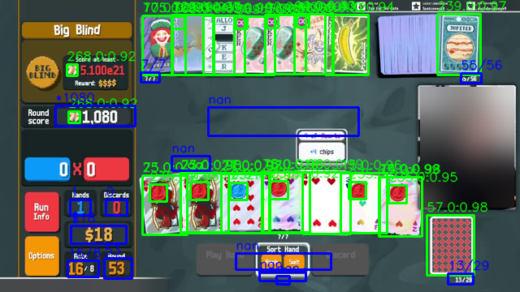
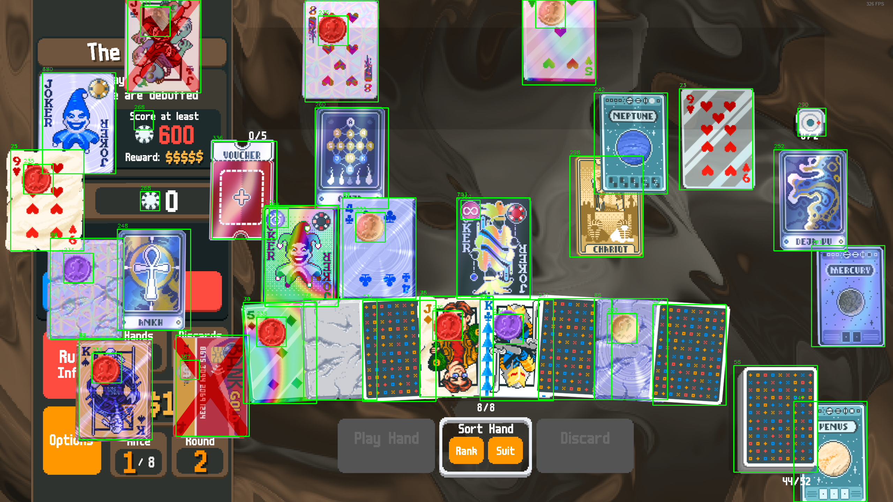
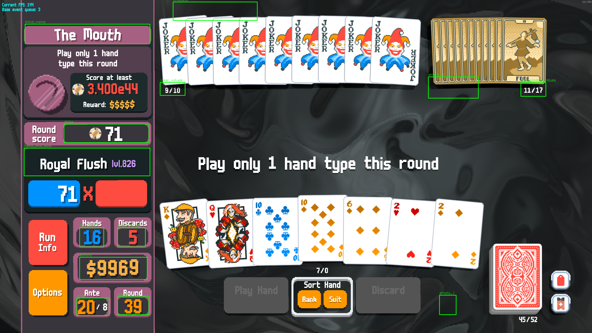

# Balatro CV Pipeline

Balatro does not expose an API or structured logging interface for accessing the full game state.
This repository provides a computer vision pipeline that reconstructs structured gameplay state from video recordings.

The extracted state can then be used for large-scale dataset generation and imitation learning experiments.

Pipeline stages:

1. **Object detection** (YOLO)
2. **OCR extraction** (PaddleOCR)
3. **Structured state reconstruction**

The output is a per-frame representation of game state (chips, blinds, jokers, hand info, economy values, etc.) suitable for training ML agents.

Dataset:
https://huggingface.co/datasets/marco-costa-ml/balatro-imitation-learning

---

# Example Output

Below is an example frame processed by the pipeline.
YOLO detections and OCR outputs have been merged and rendered back onto the frame to visualize the reconstructed state.



Stream footage used for this example comes from **[roffle](https://www.twitch.tv/roffle)**.
The streamer's face has been intentionally blurred for privacy.

---

# Example Model Outputs

## Object Detection



Example annotation:

```
assets/synthetic_detection_example.json
```

---

## OCR Extraction



Example annotation:

```
assets/synthetic_ocr_example.json
```

---

# Pipeline Overview

```
Gameplay Video
      │
      ▼
Frame Extraction
      │
      ▼
YOLO Detection
(cards, UI elements, jokers, etc.)
      │
      ▼
Region Cropping
      │
      ▼
PaddleOCR
(text fields such as chips, blinds, ante)
      │
      ▼
Structured Frame State
(CSV / tabular representation)
```

The final output is a **structured dataset describing the game state at each frame**, enabling downstream training of ML agents.

---

# Repository Structure

```
balatro-cv-pipeline/

data_collection/      lua scripts for in-game data extraction
detection/            YOLO training + datasets
ocr/                  PaddleOCR training + benchmarking

scripts/
  detect/             run trained detection models
  ocr/                run OCR pipelines

tools/                dataset preparation utilities

data_local/           local storage for videos + outputs
assets/               example images and annotations
```

Each module contains its own README with additional details.

---

# Quick Start

Run detection on a video:

```
python scripts/detect/detect_single.py --video path/to/video.mp4
```

Run OCR on detection outputs:

```
python scripts/ocr/ocr_single.py --input detections.csv
```

Bulk processing scripts are also provided for processing large video datasets.

---

# Dataset

Gameplay data extracted using this pipeline is available here:

https://huggingface.co/datasets/marco-costa-ml/balatro-imitation-learning

The dataset includes:

* gameplay videos
* detection outputs
* OCR frame data
* structured state representations

---

# Project Purpose

This repository exists to generate **high-quality training data for a Balatro imitation learning agent**.

The system enables large-scale extraction of gameplay state directly from recorded runs, making it possible to train agents without requiring direct access to the game engine or internal APIs.

---

# License

See `LICENSE`.
